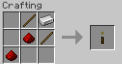

# 🌌 Survival Parkour Wand (SPW) — Fabric 1.20.1

**SPW** adds a **replayable parkour mini-game** to Minecraft **survival mode**.  
With the **Parkour Wand**, you can launch a procedural path of platforms that always stays within survival-possible jump ranges.  

Falling ends the run, but as long as you stay up, the path will keep growing! 🕹️

---

## ✨ Features

- 🔮 **Craftable Parkour Wand** (see [recipe](https://github.com/roawwx/Survival-Parkour-Wand?tab=readme-ov-file#%EF%B8%8F-recipe) below).
- 🌀 **Procedural path generation**:
  - Never backwards, always fair.
  - All jumps are within survival reach (≤4 blocks horizontally, ±1 vertically).
- ⚡ **Skip mechanic**:
  - Land two blocks ahead → spawns two new platforms.
- 🎆 **Visual effects**:
  - Particles on each new platform.
- 🧹 **Automatic cleanup** of placed blocks when the run ends.
- 📊 On falling, the chat displays:
  - Time survived.
  - Platforms cleared.
  - Skips performed.

---

## 🕹️ How to Play

1. **Craft the Parkour Wand** (see recipe).  
2. **Right-click** to start a run:  
   - You’ll be launched ~20 blocks up.  
   - The first platforms will appear.  
3. **Keep landing on platforms**:  
   - Each landing extends the path.  
   - Skipping exactly one block grants a **double extension**.  
4. Don’t fall! When you do, the run ends and your stats appear in chat.

---

## 📦 Requirements

- 🟢 **Minecraft** `1.20.1`  
- 🟢 **Fabric Loader**  
- 🟢 **Fabric API**  
- 🟢 **Java 17**  

✅ Works in **singleplayer** and on **servers**  
*(must be installed on both client + server for models/textures).*

---

## 🛠️ Recipe

## ⬇️ Download

- [GitHub Releases](https://github.com/roawwx/Survival-Parkour-Wand/releases/tag/releases)  
- (Modrinth / CurseForge — coming soon)

---

## 📌 Credits

👤 **Roa (Héctor)**  
- Developer & Helper at **LolameStudio**  
- Creator of [**Mobility Improvements**](https://github.com/roawwx/Mobility-Improvements/)

💬 Discord: [Roa](https://discord.com/users/495946393223954432)
